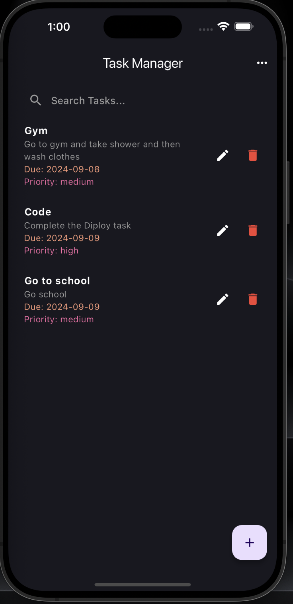
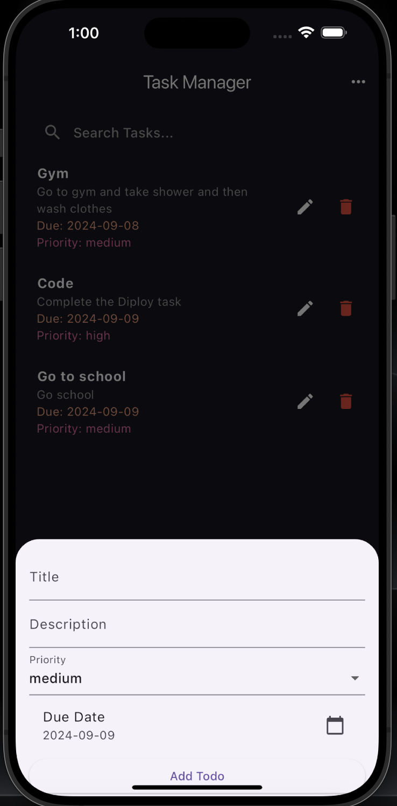

# Simple Task Manager

<!-- Adding three screenshots side by side -->
<p align="center">
  
  
</p>


## 📝 Setup Instructions

Follow these steps to set up the project locally:

### 1. Clone the Repository

```bash
git clone https://github.com/vitthalverma/task-manager.git
cd task-manager
```
### 2. Install dependencies

```bash
flutter pub get
```
### 3. Run the app 

```bash
flutter run
```

## 💡 Approach

The app is structured using clean architecture, separating concerns across different layers:

- Presentation Layer: Handles UI components and state management.
- Domain Layer: Business logic and use cases.
- Data Layer: Manages API calls. 
